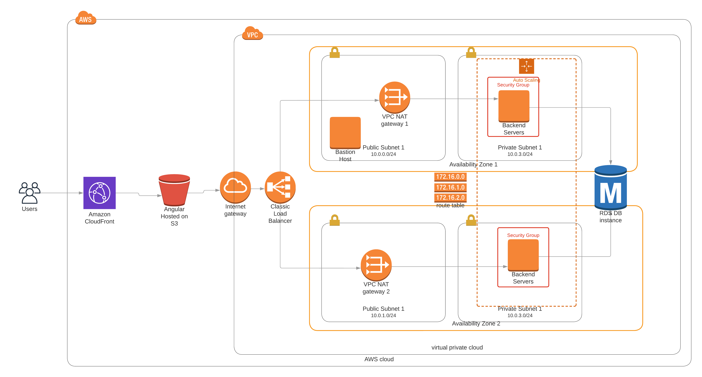

# Udgram infrastructure

## Required Environment Variables
| Environment Variable   | Description                                  |
|         :-:            |     :-:                                      |
| NETWORK_STACK_NAME     | Cloudformation Network Stack Name            |
| SERVERS_STACK_NAME     | Cloudformation Servers Stack Name            |
| DATABASE_STACK_NAME    | Cloudformation Database Stack Name           |

## Required SSH Keys to be created before first run
- Create Two SSH Keys in EC2 Console
    1) ec2acc
    2) backendprivate

## Pipeline status: 